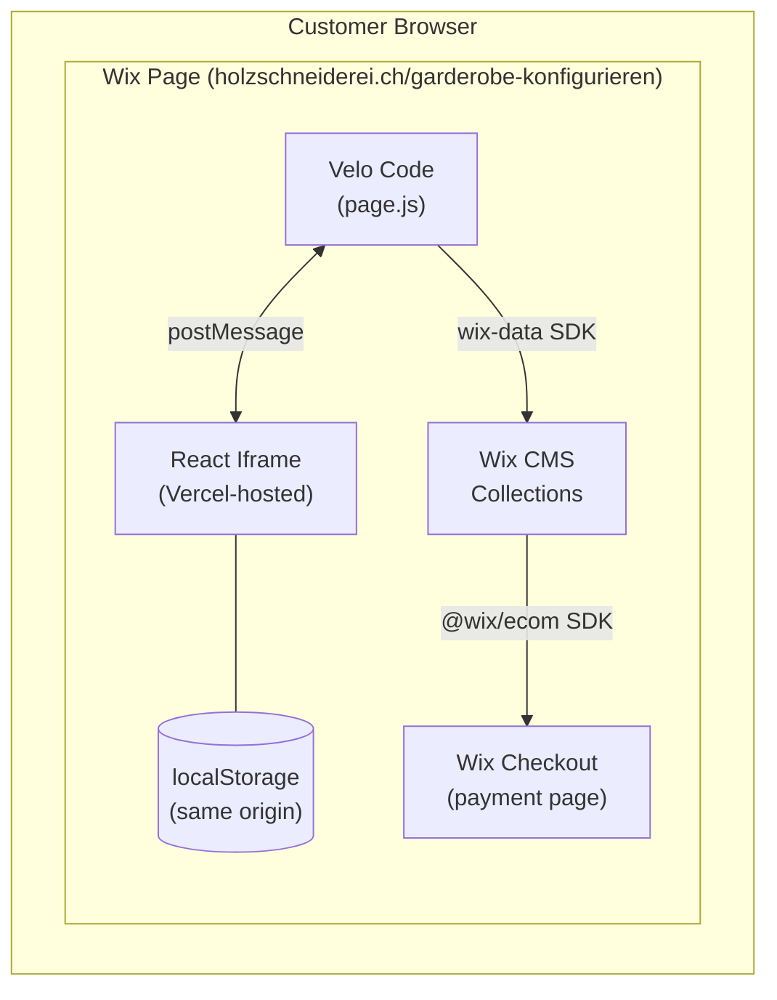
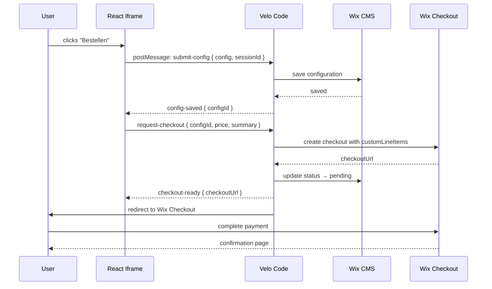

# Holzschneiderei Integration Plan

How the Vercel-hosted configurator integrates with Wix for data persistence, session recovery, and payments.

---

## Architecture Overview



**Key insight:** All Wix API calls happen from Velo page code (server-side permissions, no API keys exposed). The iframe only communicates via the existing postMessage bridge.

---

## 1. Progress Persistence (Session Recovery)

### The Problem
Third-party cookies are blocked in modern browsers. The iframe (vercel.app) cannot use its own cookies/localStorage to persist state because the origin differs from holzschneiderei.ch.

### The Solution: Parent-side localStorage via Bridge

The Wix page and the iframe share the same user session context — the Wix page runs on holzschneiderei.ch, so its `localStorage` is first-party. We use the existing postMessage bridge to ask the parent to save/load progress.

### Bridge Protocol (new message types)

| Direction | Type | Payload | Purpose |
|-----------|------|---------|---------|
| iframe -> parent | `save-progress` | `{ state: {...} }` | Save wizard state to localStorage |
| iframe -> parent | `load-progress` | — | Request saved state |
| parent -> iframe | `progress-loaded` | `{ state: {...} \| null }` | Return saved state |
| iframe -> parent | `clear-progress` | — | Clear saved state (after checkout) |

### How it works

1. **On page load:** iframe sends `load-progress`. Velo reads from `localStorage` and replies with `progress-loaded`.
2. **On every step change / field change (debounced):** iframe sends `save-progress` with the full wizard state object.
3. **On checkout completion:** iframe sends `clear-progress`.

### Implementation

**bridge.js additions (iframe side):**
```js
// Save progress (debounced — call from useEffect)
export function saveProgress(state) {
  send('save-progress', { state });
}

// Request saved progress
export function loadProgress() {
  send('load-progress');
}

// Clear progress after order
export function clearProgress() {
  send('clear-progress');
}
```

**Velo page code (Wix side):**
```js
const STORAGE_KEY = 'holzschneiderei_progress';

$w('#html1').onMessage((event) => {
  const { type, state } = event.data;

  if (type === 'save-progress') {
    localStorage.setItem(STORAGE_KEY, JSON.stringify(state));
  }

  if (type === 'load-progress') {
    const saved = localStorage.getItem(STORAGE_KEY);
    $w('#html1').postMessage({
      channel: 'holzschneiderei',
      type: 'progress-loaded',
      state: saved ? JSON.parse(saved) : null
    });
  }

  if (type === 'clear-progress') {
    localStorage.removeItem(STORAGE_KEY);
  }
});
```

### What gets saved

The full wizard state: current step, selected wood type, dimensions, surface, hooks, extras, mountain, font, name text — everything needed to resume exactly where they left off.

---

## 2. Data Storage (Wix CMS)

### Collection: `Konfigurationen`

Stores every completed configuration (submitted for checkout). This is the permanent record.

| Field | Type | Description |
|-------|------|-------------|
| `_id` | auto | Wix-generated ID |
| `sessionId` | TEXT | Random ID generated per configurator session |
| `holzart` | TEXT | Wood type value (eiche, esche, ...) |
| `oberflaeche` | TEXT | Surface finish value |
| `breite` | NUMBER | Width in cm |
| `hoehe` | NUMBER | Height in cm |
| `tiefe` | NUMBER | Depth in cm |
| `haken` | NUMBER | Number of hooks |
| `hakenMaterial` | TEXT | Hook material value |
| `extras` | TEXT | JSON array of selected extras |
| `berg` | TEXT | Mountain silhouette value |
| `schriftart` | TEXT | Font value |
| `namenszug` | TEXT | Custom name text |
| `preis` | NUMBER | Calculated price in CHF |
| `status` | TEXT | `draft` / `pending` / `paid` / `cancelled` |
| `checkoutId` | TEXT | Wix eCommerce checkout ID |
| `createdAt` | DATETIME | When the config was created |

### Collection: `KonfiguratorAdmin`

Stores admin settings (pricing, dimension constraints) — read by the admin page, pushed to the configurator.

| Field | Type | Description |
|-------|------|-------------|
| `_id` | auto | Single row, acts as settings store |
| `pricing` | TEXT | JSON of pricing config |
| `constraints` | TEXT | JSON of dimension constraints |
| `updatedAt` | DATETIME | Last modification |

### Bridge Protocol (new message types)

| Direction | Type | Payload | Purpose |
|-----------|------|---------|---------|
| iframe -> parent | `submit-config` | `{ config: {...}, sessionId }` | Save config to CMS |
| parent -> iframe | `config-saved` | `{ success, configId }` | Confirm save |
| iframe -> parent | `request-checkout` | `{ configId, price, summary }` | Trigger payment |
| parent -> iframe | `checkout-ready` | `{ checkoutUrl }` | Redirect to payment |
| parent -> iframe | `checkout-error` | `{ error }` | Payment creation failed |

### Velo: Saving a Configuration

```js
import wixData from 'wix-data';

$w('#html1').onMessage(async (event) => {
  const { type } = event.data;

  if (type === 'submit-config') {
    const { config, sessionId } = event.data;
    try {
      const result = await wixData.insert('Konfigurationen', {
        sessionId,
        ...config,
        extras: JSON.stringify(config.extras),
        status: 'draft',
        createdAt: new Date()
      });
      $w('#html1').postMessage({
        channel: 'holzschneiderei',
        type: 'config-saved',
        success: true,
        configId: result._id
      });
    } catch (err) {
      $w('#html1').postMessage({
        channel: 'holzschneiderei',
        type: 'config-saved',
        success: false,
        error: err.message
      });
    }
  }
});
```

---

## 3. Payment Integration (Wix eCommerce)

### Flow



### Velo: Creating a Checkout

```js
import { checkout } from '@wix/ecom';
import { redirect } from '@wix/location'; // for navigation

$w('#html1').onMessage(async (event) => {
  if (event.data.type === 'request-checkout') {
    const { configId, price, summary } = event.data;

    try {
      // 1. Create checkout with custom line item
      const result = await checkout.createCheckout({
        channelType: 'WEB',
        customLineItems: [{
          quantity: 1,
          price: String(price),
          productName: { original: `Garderobe: ${summary}` },
          itemType: { preset: 'PHYSICAL' },
          catalogReference: {
            appId: 'holzschneiderei-konfigurator',
            catalogItemId: configId
          }
        }]
      });

      // 2. Update CMS record with checkout ID
      await wixData.update('Konfigurationen', {
        _id: configId,
        checkoutId: result._id,
        status: 'pending'
      });

      // 3. Navigate to Wix checkout
      redirect(result.checkoutUrl);

    } catch (err) {
      $w('#html1').postMessage({
        channel: 'holzschneiderei',
        type: 'checkout-error',
        error: err.message
      });
    }
  }
});
```

### After Payment: Update Status

Use a Wix **backend event** (in `events.js` or via webhook) to listen for order completion:

```js
// backend/events.js (Wix Velo backend)
import wixData from 'wix-data';

export function wixEcom_onOrderCreated(event) {
  const order = event.entity;
  // Find the config by checkout ID and mark as paid
  const checkoutId = order.checkoutId;

  wixData.query('Konfigurationen')
    .eq('checkoutId', checkoutId)
    .find()
    .then(results => {
      if (results.items.length > 0) {
        const item = results.items[0];
        item.status = 'paid';
        wixData.update('Konfigurationen', item);
      }
    });
}
```

---

## 4. Admin Page Integration

The admin page (`/konfigurator-admin`) loads the same iframe but in admin mode. It reads/writes the `KonfiguratorAdmin` collection to manage pricing and constraints.

| Direction | Type | Payload | Purpose |
|-----------|------|---------|---------|
| parent -> iframe | `admin-settings` | `{ pricing, constraints }` | Push settings to admin UI |
| iframe -> parent | `save-settings` | `{ pricing, constraints }` | Save updated settings |
| parent -> iframe | `settings-saved` | `{ success }` | Confirm save |

The admin page Velo code distinguishes itself by sending `admin-settings` on load. The iframe detects this and switches to admin mode.

---

## 5. Complete Bridge Message Catalog

| Type | Direction | Payload | Category |
|------|-----------|---------|----------|
| `resize` | iframe -> parent | `{ height }` | Existing |
| `save-progress` | iframe -> parent | `{ state }` | Session |
| `load-progress` | iframe -> parent | — | Session |
| `progress-loaded` | parent -> iframe | `{ state }` | Session |
| `clear-progress` | iframe -> parent | — | Session |
| `submit-config` | iframe -> parent | `{ config, sessionId }` | Data |
| `config-saved` | parent -> iframe | `{ success, configId }` | Data |
| `request-checkout` | iframe -> parent | `{ configId, price, summary }` | Payment |
| `checkout-ready` | parent -> iframe | `{ checkoutUrl }` | Payment |
| `checkout-error` | parent -> iframe | `{ error }` | Payment |
| `admin-settings` | parent -> iframe | `{ pricing, constraints }` | Admin |
| `save-settings` | iframe -> parent | `{ pricing, constraints }` | Admin |
| `settings-saved` | parent -> iframe | `{ success }` | Admin |

---

## Setup Guide

### Step 1: Wix CMS Collections

1. Go to **Wix Dashboard > CMS**
2. Create collection **`Konfigurationen`** with fields from the table above
3. Create collection **`KonfiguratorAdmin`** with a single row for settings
4. Set permissions:
   - `Konfigurationen`: Admin can read/write, site members can insert
   - `KonfiguratorAdmin`: Admin only

### Step 2: Wix eCommerce

1. Go to **Wix Dashboard > Settings > Accept Payments**
2. Set up Wix Payments (or connect Stripe/other provider)
3. Ensure the site is on a **Premium plan** (required for payments)
4. Currency should be set to **CHF**

### Step 3: Wix Velo Page Code

1. Enable **Dev Mode** in the Wix Editor (top menu bar)
2. On the page `/garderobe-konfigurieren`:
   - Add an **HtmlComponent** (embed > custom element or HTML iframe)
   - Set its source URL to `https://holzschneiderei.vercel.app`
   - Give it an ID (e.g., `#html1`)
   - In the page code panel, add the Velo code handling all message types (see sections above)
3. On the page `/konfigurator-admin`:
   - Same HtmlComponent setup, but the Velo code sends `admin-settings` on load

### Step 4: Wix Backend Events

1. In Velo, create `backend/events.js`
2. Add the `wixEcom_onOrderCreated` handler to update config status to `paid`

### Step 5: Vercel (no changes needed for basic flow)

The React app only talks via postMessage. No Vercel API routes, no API keys, no server-side logic needed for the core integration. The Velo layer handles all Wix API calls.

**Optional Vercel enhancement:** If you want to cache admin settings (pricing/constraints) to avoid loading delays, you could add a Vercel API route that caches the latest settings. But this is an optimization, not a requirement.

### Step 6: Testing

1. Open `/garderobe-konfigurieren` in the browser
2. Configure a wardrobe, close the tab, reopen — progress should be restored
3. Complete a configuration and trigger checkout — should redirect to Wix payment page
4. After payment, check the `Konfigurationen` collection — status should be `paid`

---

## Implementation Order

1. **Bridge expansion** — Add new message types to `bridge.js`
2. **Progress persistence** — localStorage save/load via Velo (quick win, immediately useful)
3. **CMS collections** — Create in Wix, write Velo insert/query code
4. **Submit flow** — Wire up "Bestellen" button to save config + create checkout
5. **Payment** — Test end-to-end with Wix sandbox/test payments
6. **Admin settings** — Read/write KonfiguratorAdmin collection from admin page
7. **Order status webhook** — Backend event to mark configs as paid
